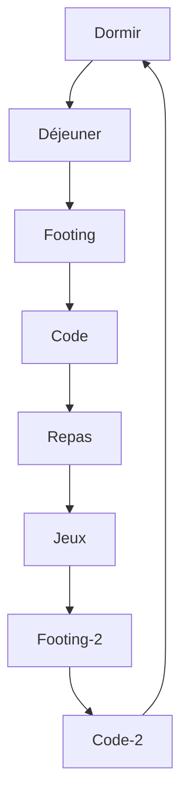

<h1 align="center">Salut 👋, Je suis XStorm un développeur français</h1>
<h3 align="center">J'adore travailler sur plusieurs projets</h3>

- 🔭 Travaille actuellement sur la **V1 - rentabot** un site ou tu peut prendre un hébergement ou louer un bot discord
- 🌱 J'apprend actuellemet le **TypeScript** et le **SCSS**
- 📫 Comment me contacter : discord ? (xanero_officiel)
- ⚡ Fun fact : je mange tacos, kebab, mcdo, burger king tous les soirs mais je pèse que 52Kg

### ⭐ Stats GitHub

 

 

<h2 align="left">Languages de programmations et logiciels utiliser:</h2>

                        

### Ma journée quotidienne :

